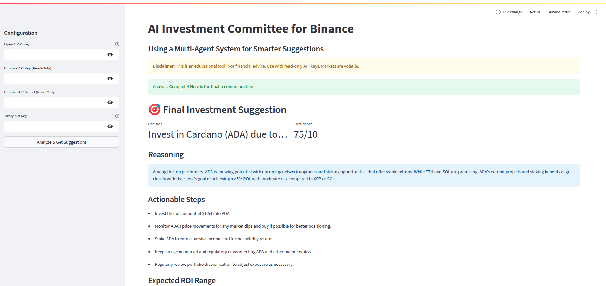

# AI Investment Committee for Binance

A multi-agent AI system that provides intelligent investment suggestions for cryptocurrency trading on Binance.


## 🌟 Overview

The AI Investment Committee creates a panel of specialized AI agents that work together to provide comprehensive investment suggestions for cryptocurrency trading on Binance. Each agent has a specific role and expertise area:

1. **Market Analyst** - Assesses overall market conditions and trends
2. **Portfolio Analyst** - Reviews your existing assets and identifies optimization opportunities 
3. **Risk Assessor** - Evaluates potential risks and suggests mitigation strategies
4. **Chief Strategist** - Makes the final investment decision based on all available information

## 🔍 Features

- **Real-time Portfolio Analysis** - Connect securely with read-only Binance API keys
- **Market Intelligence** - Analyze current market conditions and trends
- **Web Search Integration** - Get real-time information from the web via Tavily API
- **Risk Management** - Comprehensive risk assessment and mitigation strategies
- **Structured Output** - Clear, actionable investment recommendations
- **Transparent Decision Making** - Full visibility into each agent's reasoning

## 🚀 Getting Started

### Prerequisites

- Python 3.10+
- A Binance account with API keys (read-only permissions recommended)
- OpenAI API key
- Tavily API key (for web search functionality)

### Installation

1. **Clone the repository**
   ```bash
   git clone https://github.com/yourusername/binance-agent.git
   cd binance-agent
   ```

2. **Set up a virtual environment**
   ```bash
   python -m venv venv
   source venv/bin/activate  # On Windows: venv\Scripts\activate
   ```

3. **Install dependencies**
   ```bash
   pip install -r requirements.txt
   ```

4. **Set up environment variables**
   Create a `.env` file in the project root with the following contents:
   ```
   OPENAI_API_KEY=your_openai_api_key
   BINANCE_API_KEY=your_binance_api_key
   BINANCE_API_SECRET=your_binance_api_secret
   TAVILY_API_KEY=your_tavily_api_key
   ```

### Usage

1. **Launch the Streamlit app**
   ```bash
   streamlit run app.py
   ```

2. **Enter your API keys** (if not already in the .env file)
   - OpenAI API Key
   - Binance API Key (read-only recommended)
   - Binance API Secret

3. **Click "Analyze & Get Suggestions"**
   - The app will fetch your Binance portfolio data
   - Generate relevant web search queries
   - Click "Run Web Search with These Queries" to continue
   - The AI agents will analyze the data and provide recommendations

4. **Review the recommendation**
   - Final investment decision (INVEST, HOLD, AVOID)
   - Specific coin recommendation and investment amount (if applicable)
   - Confidence score
   - Reasoning and actionable steps
   - Expected ROI range and investment timeline

5. **Examine detailed reports**
   - Market analysis
   - Portfolio analysis
   - Risk assessment
   - Web search context

## 🔒 Security

This application is designed with security in mind:
- Uses read-only API keys from Binance
- API keys are stored locally in your .env file and never shared
- All analysis is performed locally on your machine

## ⚠️ Disclaimer

This tool is for educational purposes only. It is not financial advice. Cryptocurrency markets are highly volatile, and all investment decisions should be made after careful consideration. Always use read-only API keys when connecting to exchanges.

## 📝 Project Structure

```
binance-agent/
├── app.py                  # Main Streamlit application
├── requirements.txt        # Python dependencies
├── .env                    # Environment variables (not committed to repo)
├── README.md               # This file
└── notebooks/              # Jupyter notebooks with exploratory analysis
    ├── binance_ai_agent_poc_v1.ipynb
    └── binance_ai_agent_poc.ipynb
```

## 📚 Technologies Used

- **Streamlit** - Web application framework
- **OpenAI API** - Powers the AI agents with structured output
- **Binance API** - Fetches cryptocurrency portfolio and market data
- **Tavily API** - Real-time web search for market intelligence
- **Pydantic** - Data validation and settings management
- **Python-dotenv** - Environment variable management

## 📸 Snapshots

Here are some snapshots of the application in action:


*Initial Portfolio Analysis Screen*


*Market Analysis Dashboard*


*Risk Assessment View*


*Web Seach Context Used*


*Final Investment Recommendations*


## 🤝 Contributing

Contributions are welcome! Please feel free to submit a Pull Request.

## 📄 License

This project is licensed under the MIT License - see the LICENSE file for details.

## 🙏 Acknowledgements

- OpenAI for providing the API that powers the AI agents
- Binance for their comprehensive API
- Tavily for web search capabilities
- The Streamlit team for making interactive data apps easy to build
